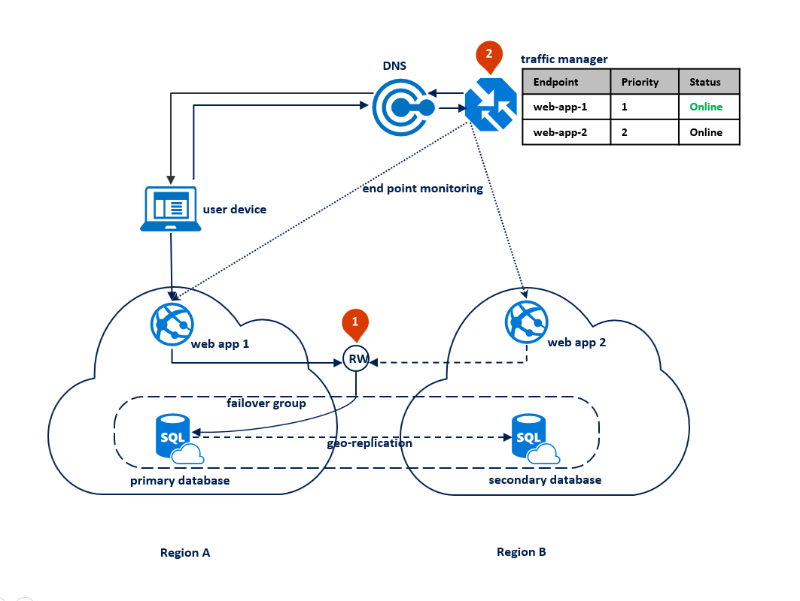
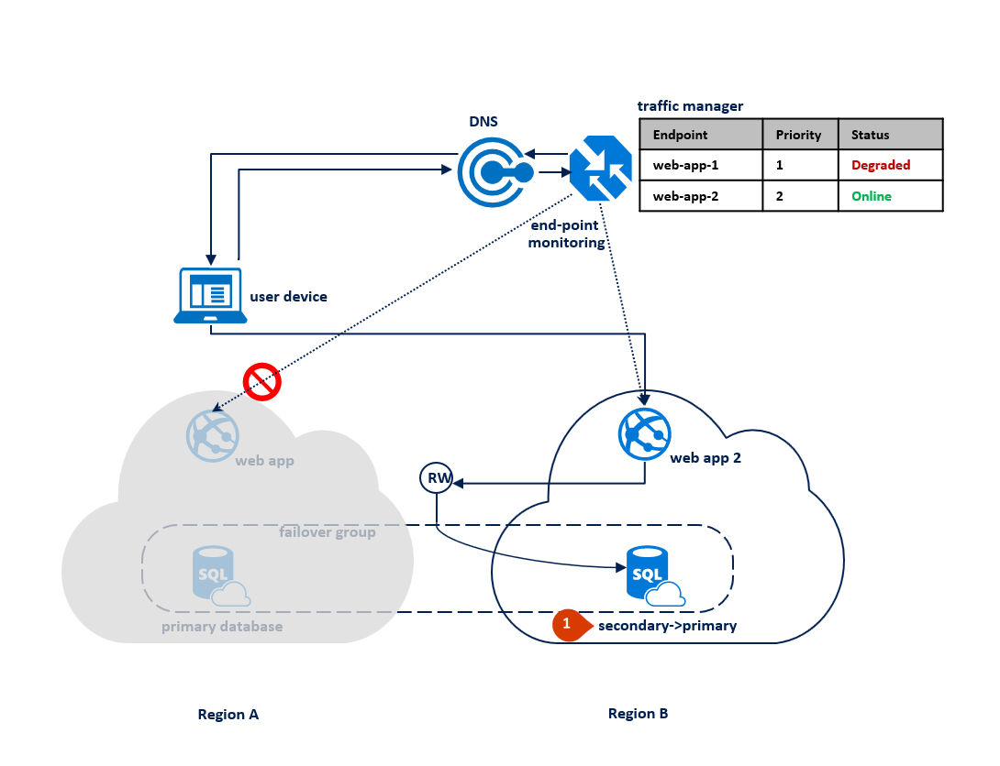

# Azure PaaS Multi-Region Failover Simulator (BETA)

In this solution, the applications have the following characteristics:

* Application is active in one Azure region
* All database sessions require read and write access (RW) to data
* Web tier and data tier must be collocated to reduce latency and traffic cost
* Fundamentally, downtime is a higher business risk for these applications than data loss

## Solution architecture

### Normal behavior



### During a region outage



## Deployment

Click below button to automatically deploy this solution architecture using Azure ARM Template:

<a href="https://portal.azure.com/#create/Microsoft.Template/uri/https%3A%2F%2Fraw.githubusercontent.com%2Fjdmsft%2FAzurePaaSMultiRegion%2Fmaster%2Fdeployment%2FazureDeployment.json" target="_blank"></a>

## Import database data

````sql
SET ANSI_NULLS ON
GO
SET QUOTED_IDENTIFIER ON
GO
CREATE TABLE [dbo].[Order](
	[OrderId] [int] IDENTITY(1,1) NOT NULL,
	[ProductCode] [nvarchar](20) NULL,
	[Quantity] [int] NOT NULL,
	[OrderDateTime] [datetime] NOT NULL,
 CONSTRAINT [PK_Order] PRIMARY KEY CLUSTERED 
(
	[OrderId] ASC
)WITH (STATISTICS_NORECOMPUTE = OFF, IGNORE_DUP_KEY = OFF) ON [PRIMARY]
) ON [PRIMARY]
GO
SET IDENTITY_INSERT [dbo].[Order] ON 

INSERT [dbo].[Order] ([OrderId], [ProductCode], [Quantity], [OrderDateTime]) VALUES (1, N'001', 32, CAST(N'2021-06-01T10:54:17.413' AS DateTime))
INSERT [dbo].[Order] ([OrderId], [ProductCode], [Quantity], [OrderDateTime]) VALUES (2, N'002', 38, CAST(N'2021-06-02T03:24:58.713' AS DateTime))
INSERT [dbo].[Order] ([OrderId], [ProductCode], [Quantity], [OrderDateTime]) VALUES (3, N'003', 591, CAST(N'2021-06-02T03:33:10.513' AS DateTime))
INSERT [dbo].[Order] ([OrderId], [ProductCode], [Quantity], [OrderDateTime]) VALUES (5, N'004', 18, CAST(N'2021-06-08T07:43:20.567' AS DateTime))
INSERT [dbo].[Order] ([OrderId], [ProductCode], [Quantity], [OrderDateTime]) VALUES (6, N'005', 82, CAST(N'2021-06-08T07:43:22.850' AS DateTime))
INSERT [dbo].[Order] ([OrderId], [ProductCode], [Quantity], [OrderDateTime]) VALUES (7, N'006', 78, CAST(N'2021-06-10T09:08:18.537' AS DateTime))
INSERT [dbo].[Order] ([OrderId], [ProductCode], [Quantity], [OrderDateTime]) VALUES (8, N'007', 36, CAST(N'2021-06-10T09:08:19.847' AS DateTime))
INSERT [dbo].[Order] ([OrderId], [ProductCode], [Quantity], [OrderDateTime]) VALUES (9, N'008', 93, CAST(N'2021-06-10T09:08:20.863' AS DateTime))
SET IDENTITY_INSERT [dbo].[Order] OFF
GO
ALTER TABLE [dbo].[Order] ADD  CONSTRAINT [DF_Order_Quantity]  DEFAULT (floor(rand()*(((25)-(10))+(1)))+(10)) FOR [Quantity]
GO
ALTER TABLE [dbo].[Order] ADD  CONSTRAINT [DF_Order_OrderDateTime]  DEFAULT (getdate()) FOR [OrderDateTime]
GO
````

## Known issues

Please refer to the [known issues](known-issue.md) doc in case you've encontered any issue.